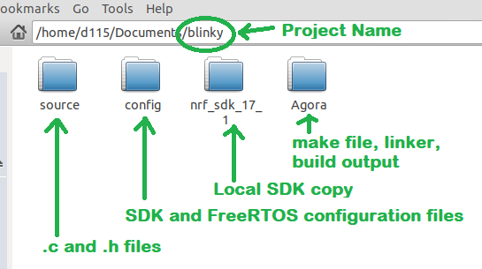

# NORDIC SOFTWARE DEVELOPMENT KIT (SDK V17.1.0)
This development kit is used for developing code on the Nordic nXRF5240 processor for bare metal and FreeRTOS applications.

The Agora is currently supported.

## SETUP
To properly compile projects, This SDK is typically closed into the individual project folder. 

1. Load the GCC 11.3.Rel1 - AArch32 bare-metal target (arm-none-eabi) tool suite: https://developer.arm.com/downloads/-/arm-gnu-toolchain-downloads

1. Unzip the suite, for Linux use the command line: sudo tar -xf arm-gnu-toolchain-11.3.rel1-x86_64-arm-none-eabi.tar.xz -C /opt

1. Clone this repository: https://github.com/EmbeddedPlanet/nrf_sdk_17_1

1. Clone and compile the individual projects per instructions provided with the specific projects README.  Individual projects then reference the SDK and GCC installed above.

##  Making SDK examples into free standing projects:



1. Copy the directory from "nrf_sdk_17_1/examples" to the documents folder.

1. Rename the copied directory to have a new project name.

1. Open the new project directory:
    1. Rename the "pca10056" sub-directory to "Agora" (the Agora and the pca10056 development board are based on the same nRF52840 controller). 

    1. Delete the other "pca<XXXXX>" directories.

    1. If a "config" directory (holding FreeRtos config files) doesn't already exist, create a "config" directory.

    1. Create a "source" directory.
    
    1. Delete the "hex" folder.

    1. Delete the "*.eww" file.

    1. Move *.c, *.cpp, and *.h files to the source folder.

    1. Clone the nrf_sdk_17_1 repository to the project folder. 

1. From the newly renamed Agora directory:

    1. Open the "blank/armgcc" sub-directory and copy the "Makefile" and "*.ld" file to the Agora directory.

    1. Open the "blank/config" sub-directory and copy the "sdk_config.h" file to the newly created "config" directory in the project root.

    1. Delete the "blank" directory and sub-folders.

    1. Open the "Makefile" in a text editor and make the following changes:

        1. Change "SDK_ROOT := ../../../../../.." to "SDK_ROOT := ../nrf_sdk_17_1"

        1. Change "PROJ_DIR := ../../.." to "PROJ_DIR := .."

        1. Under "SRC_FILES += \" Files that have been moved to the source directory are updated to include the "source" sub-directory.  
    For example: ```"$(PROJ_DIR)/main.c \"``` is changed to: ```"$(PROJ_DIR)/source/main.c \" ```
 
        1. Under "# C flags common to all targets": 

            1. change "CFLAGS += -DBOARD_PCA10056" to: "CFLAGS += -DBOARD_AGORA"   
 
        1. Under "# C++ flags common to all targets":

            1. Change "ASMFLAGS += -DBOARD_PCA10056" to: "ASMFLAGS += -DBOARD_AGORA"

        1. Cleanup the linker script file name and the Makefile reference (usually has the example as part of the name).  For example change the name of "LINKER_SCRIPT  := blinky_FreeRTOS_gcc_nrf52.ld" to "LINKER_SCRIPT  := FreeRTOS_gcc_nrf52.ld" in the Makefile, then rename "blinky_FreeRTOS_gcc_nrf52.ld" to "FreeRTOS_gcc_nrf52.ld" in the Agora directory.

    1. To build the example:

        1. Under the Agora sub-directory open a terminal window and type:
make

        1. A "_build" sub-directory is created from the Agora directory and an output file "nrf52840_xxaa.hex" is generated. The hex file can drag/dropped to the Agora using a Flidor and DAPLINK.  The "_build" directory should be deleted if source files are moved or after the Makefile is edited.  The "_build" directory and artifacts are recreated when "make" is run.

## Visual Studio Code (VSCode)
VSCode can be used to edit projects (such as an example, copied as shown above).  

To open a project in VSCode, right click on the project folder and select "Open in VSCode" from the drop-down menu.

### VSCode Setup
When a project is open in VSCode a ".vscode" directory is added to the project.  To allow IntelliSense to function properly the project and sdk need to be connected.

Edit the "c_cpp_properties.json" to contain the following:

```
{
    "env": {
        "nrfSDK": "../nrf_sdk_17_1"
    },
    "configurations": [
        {
            "name": "Linux",
            "includePath": [
                "${nrfSDK}/components/**",
                "${nrfSDK}/modules/**",
                "${nrfSDK}/integration/**",
                "${nrfSDK}/external/**",
                "${workspaceFolder}/**"
            ],
            "defines": ["NRF52840_XXAA",
                "BOARD_AGORA"],
            "compilerPath": "/usr/bin/gcc",
            "cStandard": "gnu11",
            "cppStandard": "gnu++14",
            "intelliSenseMode": "linux-gcc-x64"
        }
    ],
    "version": 4
}
```


        


